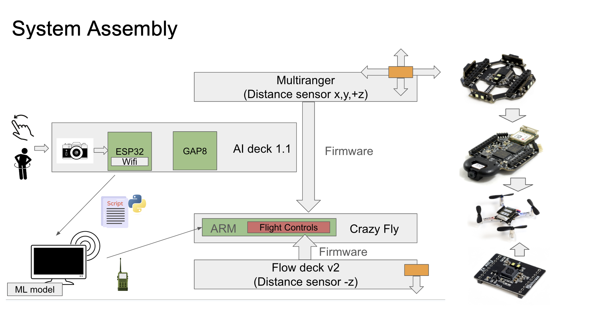
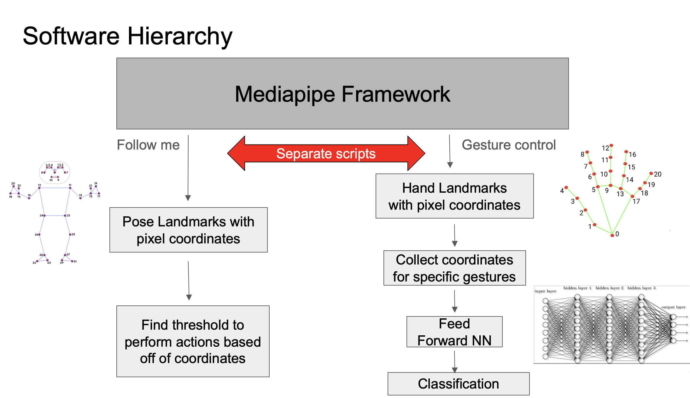

# Gesture and Body Position Drone  
### **By: Amna Hayat, Calvin Li, Nicholas Prakoso, Renzheng Zheng**  

## **Overview**  
This project showcases my culminating capstone project to design a **gesture-controlled and "follow-me" drone** using machine learning and embedded systems. The project integrates **computer vision, drone flight control, and real-time gesture recognition** to enable a **Crazyflie 2.1 drone** to respond to hand gestures and body movements.

## **Project Objective**  
- Control a **Crazyflie drone** using **hand gestures**.  
- Enable **body movement-based "follow-me" mode**.  
- Implement **active object avoidance**.  
- Integrate **machine learning (ML) for gesture and body movement recognition**.  
- Utilize onboard **camera and sensor data** for accurate flight control.  

---

## **Hardware Components**  
| Component          | Purpose |
|-------------------|---------|
| **Crazyflie 2.1** | Small programmable drone |
| **AI Deck**      | Runs onboard machine learning models, includes camera & WiFi |
| **Multiranger Deck** | Detects objects around the drone (up to 4m) |
| **Flow Deck**     | Measures drone movement relative to the ground |
| **CrazyRadio PA** | Enables communication between the drone and the computer |

---

## **Software & Libraries**  
The software stack is primarily **Python-based**, utilizing the following key libraries:  
- **OpenCV** → Image processing  
- **NumPy** → Mathematical operations  
- **MediaPipe** → Body & hand landmarks detection  
- **TensorFlow** → Gesture classification using a Neural Network  
- **Bitcraze firmware & cfclient** → Drone control and communication  

### **System Diagram**
             +---------------------------+
             |       Crazyflie 2.1       |
             |   - AI Deck (Camera)      |
             |   - Flow Deck (Position)  |
             |   - Multiranger Deck      |
             +------------+--------------+
                          |
           +--------------+--------------+
           |         Computer (PC)       |
           | - Gesture & Pose Detection  |
           | - Machine Learning Model    |
           | - Control Commands via Radio|
           +----------------------------+

### **Software Hierarchy**

---

## **Implementation Procedure**  
### **Setup Environment**  
1. Install **Bitcraze VM** (Virtual Machine) and update to the latest GitHub repository.  
2. Use **Zadig** to configure the CrazyRadio dongle.  
3. Set up **cfclient** in the VM.  
4. Install **Docker** (only required for AI Deck updates).  
5. Flash updated **Crazyflie firmware** with Flow Deck & Multiranger Deck.  
6. Update **AI Deck firmware** and enable **WiFi**.  

### **Gesture Recognition & Follow-Me Algorithm**  
1. Use **MediaPipe** to extract **pose & hand landmarks**.  
2. Normalize landmark coordinates and feed into a **Neural Network (NN)** for classification.  
3. Map classified gestures to **drone flight commands**.  
4. Implement **follow-me behavior** by tracking body movements in the camera feed.  

---
